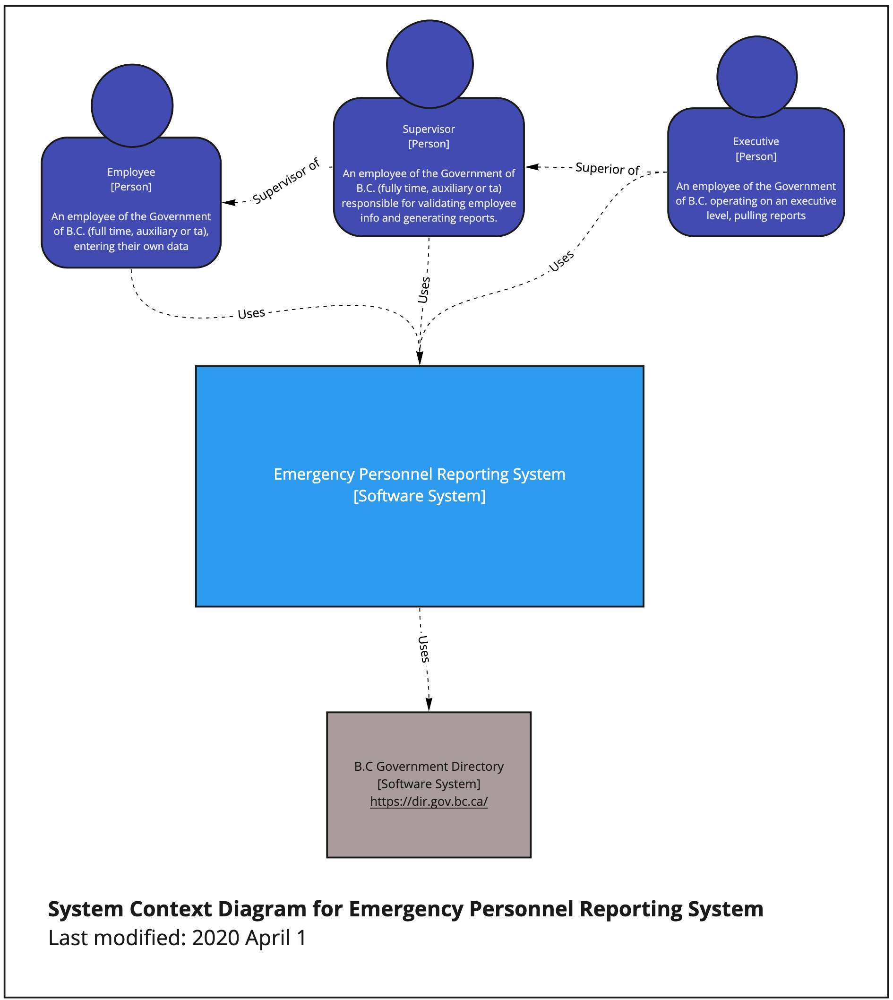
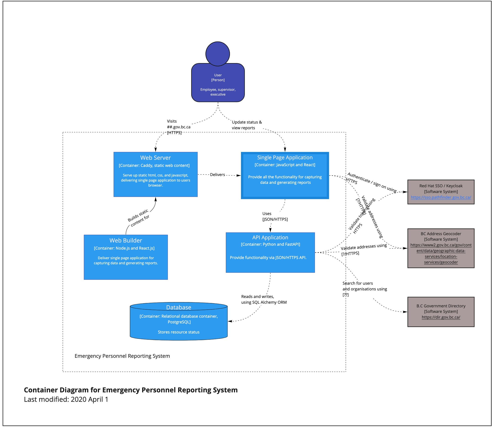

# epr

Emergency Personnel Reporting

## Getting Started

### Dependencies

#### Docker

- Docker [Mac](https://hub.docker.com/editions/community/docker-ce-desktop-mac/), [Win](https://hub.docker.com/editions/community/docker-ce-desktop-windows/), [Ubuntu](https://docs.docker.com/install/linux/docker-ce/ubuntu/), [Fedora](https://docs.docker.com/install/linux/docker-ce/fedora/)

- Docker Compose

On Mac:

```
brew install docker-compose
```

### Installing and running application

```
docker-compose up --build
```

OR

```
docker-compose --build
docker-compose up
```

## Architecture

### System Context Diagram



### Container Diagram



### Component Diagram

See [EPR API component diagram](api/README.md#component-diagram)
