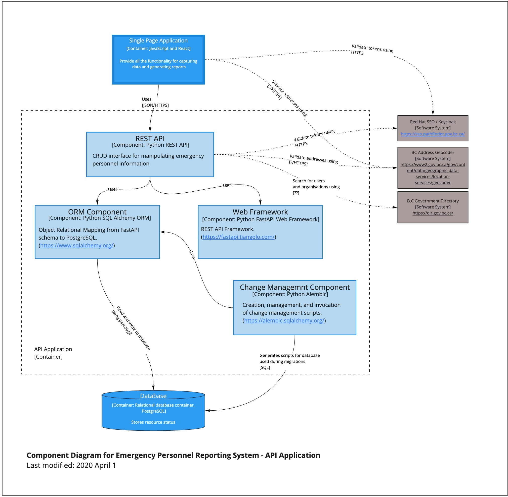

# Emergency Personnel Reporting API

## Description

Emergency Personnel Reporting

## Getting Started

### Dependencies

#### Docker

- Docker [Mac](https://hub.docker.com/editions/community/docker-ce-desktop-mac/), [Win](https://hub.docker.com/editions/community/docker-ce-desktop-windows/), [Ubuntu](https://docs.docker.com/install/linux/docker-ce/ubuntu/), [Fedora](https://docs.docker.com/install/linux/docker-ce/fedora/)

- Docker Compose

On Mac:

```
brew install docker-compose
```

#### psycopg2

[Psycopg2](https://www.psycopg.org/) is a PostgreSQL adapter for Python which has some dependancies you need to install before it will compile correctly. If you are purely developing using Docker, you don't need this installed.

On Mac:

psycopg2 requires certain libraries to work, install PostgreSQL locally.

```
brew install postgresql
```

On Ubuntu:

```
sudo apt-get install postgresql libpq-dev postgresql-client postgresql-client-common

python3 -m pip install pipenv
python3 -m pipenv install --dev
```

### Installing database objects

```
python3 create_db.py
```

### Installing API

#### Local machine, on Mac / Ubuntu

```
make init
```

See [Makefile](Makefile) for details, the command above will effectively execute:

```
pipenv install --dev
```

If you pipenv is in an unexected location, you can override it's location, e.g.

```
make PIPENV='python3 -m pipenv' init
```

### Running API

#### Local machine, on Mac / Ubuntu

```
make run
```

#### [Makefile](Makefile)

Refer to the [Makefile](Makefile) for various other useful commands for running tests, linting etc.

## Architecture

### Component Diagram


